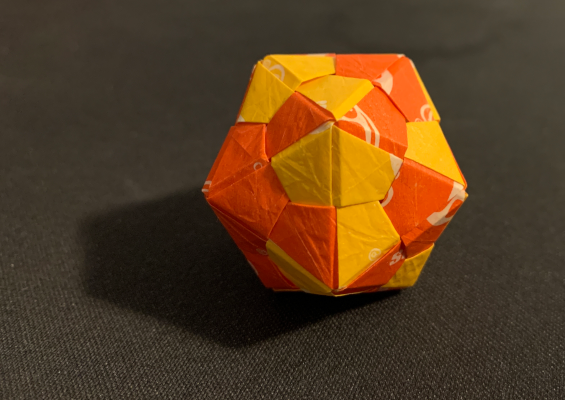
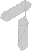
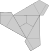

---
title = "Equilateral Triangle Edge Unit"
url = "equilateral-triangle-edge-unit"
published = 2025-08-27T05:00:04+00:00
---


``` =html

```

_I have enjoyed mindlessly crafting more than a few cranes, but what I do not enjoy is the resulting flock. After the process of folding these cranes they are a major annoyance becoming clutter on my desk. Eventually these get thrown away or for a few given away. However, because I often elected to make these cranes from material predestined for disposal, such as sticky notes and candy wrapper fragments, these where not the most appealing birds. I continued to fold cranes until for a friend's birthday I decided to make and gift an icosahedron. This is a shape strongly associated with Dungeons & Dragons due to its role as the largest play die in many variants of table top role playing games. I pursued a cursed single sheet construction of an icosahedron, but after finding that it was not particularly sturdy, I decided to try a modular construction._

_I have since switched out cranes for modular origami. I have found that it is easier to convince someone to take on a single collected piece such as an icosahedron making it easier to clear my desk._

---

Below is documentation on how to create and assemble *equilateral triangle edge units*.

## Description of the Unit

An *equilateral triangle edge unit* is a single unit of origami which when joined with two other identical units of origami form an equilateral triangle. Each pice participates by adding a single edge and an overlapping portion of the surface area an equilateral triangle. The edge of one triangle can be shared with another, so one triangle can be placed directly adjacent to another by adding another two more units. By continuing to add edges larger shapes are made.

## Quantity Selection

As mentioned in the previous sections triangle edges can be joined to form larger shapes. In theory any non self intersecting mesh formed only of equilateral triangles can be made. Since these triangles are formed by edges, the number of units is the number of edges. This will be different from number of triangles (faces). But if you happen to know the vertices, faces, and model topology you can use Euler's formula to compute your number of edges.

Before you plan to tessellate the plane or build a tetrahedron. There are some limits to this unit. Firstly paper has some thickness. This makes joining two triangles along one edge a bit harder the smaller the angle is. Secondly these units are joined by friction making planar tessellations more prone to falling apart. The sweet spot for this unit is the icosahedron, but with sufficient coercion smaller models such as tetrahedrons and octahedrons can be made. The edge count of an icosahedron is 30.

## Chirality

This unit is chiral. This means that "right" and "left" units are self compatible only. All Instructions are given for "left" units. The name "left" has been selected for the direction that the paper opens in [step 3](#Step-3). Another suitable naming scheme would be clockwise for the behavior of the paper in [step 3](#Step-3) and [step 4](#Step-4).

## Folding the Unit

Start with a 2 by 1 rectangular pice of paper.

### Step 1

Fold the paper along the long edge to make a square. If the paper is colored on one side, then the color hidden by this step will be the final color of the model.


### Step 2

Crease the paper back to the spine made by the first fold. The two folds will be parallel to the first.  This operation is preformed twice temporally forming a W shape. Unfold this step back to its pre-fold state.


### Step 3

Orient the paper so that the first fold opens in the left direction with the spine on the right. After, fold the the bottom left corner up so that it meets the center line crease formed by the previous step and makes a point at the fold made by the first step. This will look like a clockwise movement in left opening modules.


### Step 4

Fold the edge made by the previous fold to the edge made by the first forming a point.


### Step 5

Invert the paper and repeat steps 3 and 4. When orienting the paper three will be a tab formed by step 4 below the bottom edge.


### Step 6

The unit should appear like a bowtie with a flat edge. orient the flat edge at the top. Notice that there are two kite shapes: a left kite unobscured with an acute point to the right and a right kite which is below the left kite and partially obscured.

Fold the right kite side of the bowtie along the bottom edge of the kite so that the bottom most point of the kite meets the point where the kites meet. When done correctly the fold will meet the acute point of the left kite.


### Step 7

Flip and repeat step 6. During this step the left kite is now folded over with a tab stinking out from behind the unit.


### Step 8

Fold both tabs down over to the other side of the unit.


### Step 9

Unfold the unit to the state before executing step 6 so that the pice once again looks like a bow tie.


## Assemble a triangle

### Unit Description

Once step 9 of folding is complete the unit will appear the same as did at the beginning of 6 with the addition of some creases. These creases are used to align the units when assembling triangles. The final step before assembly is to unfold the bow tie so that the two kites are coplanar (flat). Ensure that when orienting the unit there the two flaps of the kites are visible so there is a dividing line between them. When oriented in this way only the two kites are visible.


### Step 1

with a second unit insert the head on one kite underneath the flap formed by another. The creases from the inserted kite should align with the creases and flap edge of the other kite. Two edges of an equilateral triangle are formed by the edges of the units flaps.




### Step 2

The last assembly step for a single triangle is a bit more tricky as the last edge unit will act as the flap for the first unit and be inserted into the second.



## Assembling in the Third Dimension

To form shapes in the third dimension examine the vertices which are the intersections made by the edges of the triangles. Extending the assembly steps it can be seen that by using the unused back side of an edge unit another edge unit can be added. This can be done around a single vertex so that 6 units all meet at a single point making a flat arrangement. Creating shape is primarily done by changing the number of units intersecting at a vertex.

Removing is simpler as it grants access to create the triangular faced plutonic solids: icosahedron with five edges meeting per vertex, octahedron with four edges meeting per vertex, and tetrahedron with three edges meeting per vertex. In theory two edges per vertex is also possible by folding the units onto themselves, but as the number of edges meeting goes down the angles shrink making the thickens of the paper more apparent. Parts of the plutonic solids can be merged to form other shapes.

Adding edge units more than six around a single vertex is also an option but it does not form simple convex or concave shapes as each triangle adds 60 degrees. Adding more than six requires the geometry to bend both upwards and downwards to accommodate for this. For example a stellated octahedron would have vertices with eight edges meeting. One edge per original edge on each vertex and one edge per adjacent face to facilitate stellation by adding pyramids.

### Building an Icosahedron

The icosahedron has 30 edges. All edges meet at vertices with 5 other edges. If all vertices have join 5 edges and there are no concave sections an icosahedron has been formed.

#### Tips for the Icosahedron

- Do not assemble in parts. Joining parts is harder than building on the model directly. Edges that are not joined completely are prone to fall off.
- Build whole triangles first. Avoid leaving units dangling like after step 1 in [assemble a triangle](#Assemble-a-triangle).
- Feel free to start over. The assembly of these unis is difficult for a number of reasons as units do not always stick to their original positions errors can add up.
- Start with larger paper.
